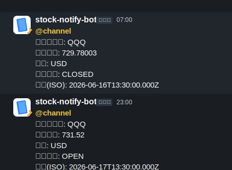

# Stock Notify Worker

Cloudflare WorkersでQQQの株価を定期取得し、条件に応じてSlackへ通知する株価通知アプリです。

## フォルダ構成

```text
src/index.ts
reference-captures/slack-notification-sample.svg
.gitignore
README.md
package.json
tsconfig.json
wrangler.toml
```

## Current Features

- QQQの株価取得
- Cloudflare Cron Triggersによる定期実行
- Slack通知
- 環境変数によるAPIキー管理

## 実行結果サンプル



参考キャプチャは `reference-captures/` フォルダに格納しています。現在はSlack通知の実行結果サンプルとして `reference-captures/slack-notification-sample.svg` を配置しています。

必要な環境変数:

- `SLACK_WEBHOOK_URL`
- `SLACK_TEST_TOKEN`
- `TWELVE_DATA_API_KEY`

Cloudflare Secret (初回設定例):

```bash
wrangler secret put TWELVE_DATA_API_KEY
```

## TODO

- 複数銘柄対応
- 通知条件のDB管理
- 取得履歴のD1保存
- 通知履歴の重複制御
